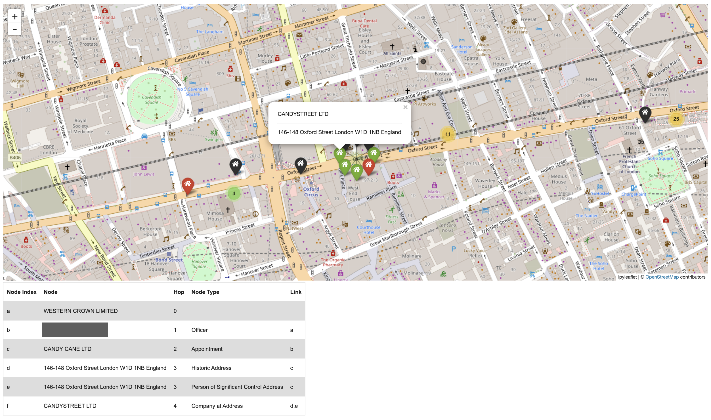
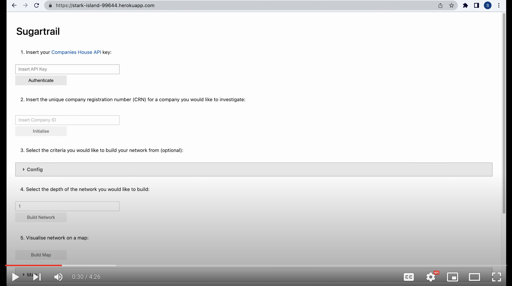

# Sugartrail



Sugartrail is a network analysis and visualisation tool developed to make it easier and faster for researchers to explore connections between companies, officers and addresses within Companies House. The tool can be used for the following use-cases:

- Get all companies, officers and addresses connected to a company within n degrees of seperation, based upon user-defined connection criteria. If two companies are connected, get the path of companies, officers and addresses connecting those companies. 
- Check if two companies are connected, and if so get the path to show how they are connected.

## Requirements

You will require an API key from Companies House to get data. First you will need to create a live application to get an API key which you can do by following the [Companies House guide](https://developer.company-information.service.gov.uk/how-to-create-an-application).

## No-Install Usage

A hosted demo of the Sugartrail dashboard can be accessed [here](https://stark-island-99644.herokuapp.com/) (might take a few seconds to load the page). This demo times out after 30 mins so may not be suitable for building large networks at present. 

## Demo

[](https://www.youtube.com/watch?v=evPXGTj33LQ)

## Installation

1. Make sure you have Conda installed

2. Download the tool's repository using the command:

```bash
git clone https://github.com/ribenamaplesyrup/sugartrail.git
```

3. Navigate to the main directory and run:

```bash
conda env create -f config/environment.yml
conda activate candystore
pip install -e .
jupyter nbextension enable --py --sys-prefix ipyleaflet
```

4. For a quickstart run `voila --no-browser --debug --Voila.ip=0.0.0.0 dashboard/Sugartrail.ipynb --VoilaConfiguration.file_whitelist="['.*']"` and navigate to the url printed in your terminal where Voilà is running at (no-code). For a more detailed explanation of the tool's capabilities, run `jupyter notebook notebooks` and open either `quickstart.ipynb` or `001_getting_started.ipynb`.


## Examples & Tutorials 

Tutorial | Title  | Description | Format
------------- | ------------- | ------------- | -------------
000  | [Quickstart](https://github.com/ribenamaplesyrup/sugartrail/blob/main/notebooks/quickstart.ipynb)  | Get companies, officers and addresses connected to select company and visualise results within basic notebook. | Jupyter Notebook
001 | [Getting Started](https://github.com/ribenamaplesyrup/sugartrail/blob/main/notebooks/001_getting_started.ipynb)  | In-depth walkthrough of Sugartrail API. | Jupyter Notebook
002 | [Candy Connections](https://github.com/ribenamaplesyrup/sugartrail/blob/main/notebooks/002_candy_connections.ipynb) | Explore how many of Oxford Street’s souvenir and candy shops are connected through a single company 🇺🇸🇬🇧🍬 | Jupyter Notebook
003 | [Virtual Offices](https://github.com/ribenamaplesyrup/sugartrail/blob/main/notebooks/003_virtual_offices.ipynb) | Explore addresses (such as virtual offices) with thousands of companies registered. This tutorial also compares two different methods of retrieving data from Companies House; the Companies House API and the Companies House Data Product download. | Jupyter Notebook
004 | [Connection Check](https://github.com/ribenamaplesyrup/sugartrail/blob/main/notebooks/004_connection_check.ipynb) | Investigate if two different companies are connected and if so how. | Jupyter Notebook
_ | [Sugartrail Dashboard](https://stark-island-99644.herokuapp.com/) | Get companies, officers and addresses connected to select company and visualise results within basic interface. | Voila Dashboard
